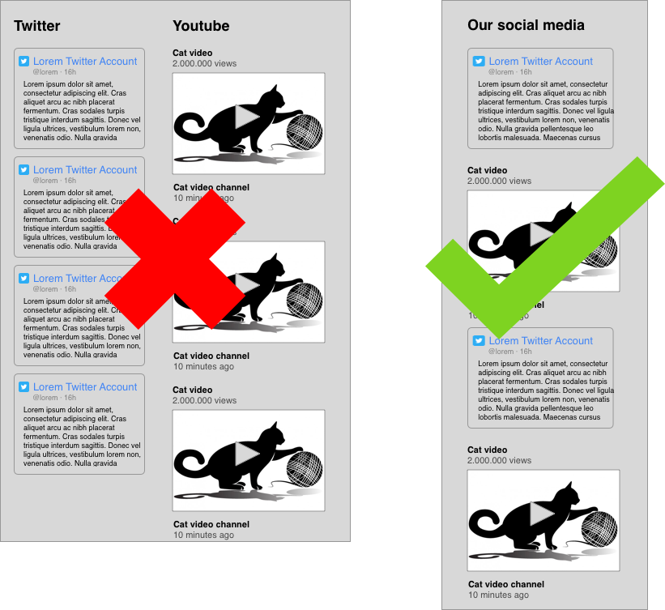

# Social media aggregator

Symfony Bundle to combine messages from different social media platforms into one feed. 

## Features
* Easy way to get messages from various social media platforms. Such as:
  * Twitter
  * Facebook*
  * Youtube
* Twig integration*
* Sorting of messages*
  * Sorting by date (default)
  * Sorting by platform (e.g. first show youtube items, then show twitter)*
* Caching
* Render messages with PHP or React
* Multiple searches for each platform

*= Not implemented yet.
  
## Installation

`composer require milosa/social-media-aggregator-bundle`

### Installation of a plugin
In your Symfony application, find kernel.php. Replace the `registerBundles` method with:

        public function registerBundles()
        {
            $contents = require $this->getProjectDir().'/config/bundles.php';
            foreach ($contents as $class => $envs) {
                if (isset($envs['all']) || isset($envs[$this->environment])) {
                    if($class === \Milosa\SocialMediaAggregatorBundle\MilosaSocialMediaAggregatorBundle::class)
                    {
                        //Each plugin class needs to be added to the array below 
                        yield new $class([
                            new \Milosa\SocialMediaAggregatorBundle\Twitter\TwitterPlugin(),
                        ]);
                    }
                    else {
                        yield new $class();
                    }
                }
            }
        }

## Usage
This bundle needs plugins in order to do something.

## Plugins
* [Twitter Plugin](https://github.com/milosa/social-media-aggregator-twitter-plugin)
* [Youtube Plugin](https://github.com/milosa/social-media-aggregator-youtube-plugin)

## React rendering (experimental)
To use the React Rendering, do the following:
* Make sure you have webpack encore installed.
* Install plugins as desired (described above)
* Run the command `php bin/console milosa-social:load-plugin-assets` This will (by default) put the assets (js and scss) from the plugins in `<project-root>/assets/milosa-social`.
    * If the directory already exists, you have to add `--overwrite=true` to the command to overwrite it.
* Put an entry for `./assets/milosa-social/js/app.js` in your webpack config
* Build with webpack (encore).

Make sure you have the API route and controller from this bundle loaded. 
The javascript will render the HTML-element with id `aggregator-app` as feed.